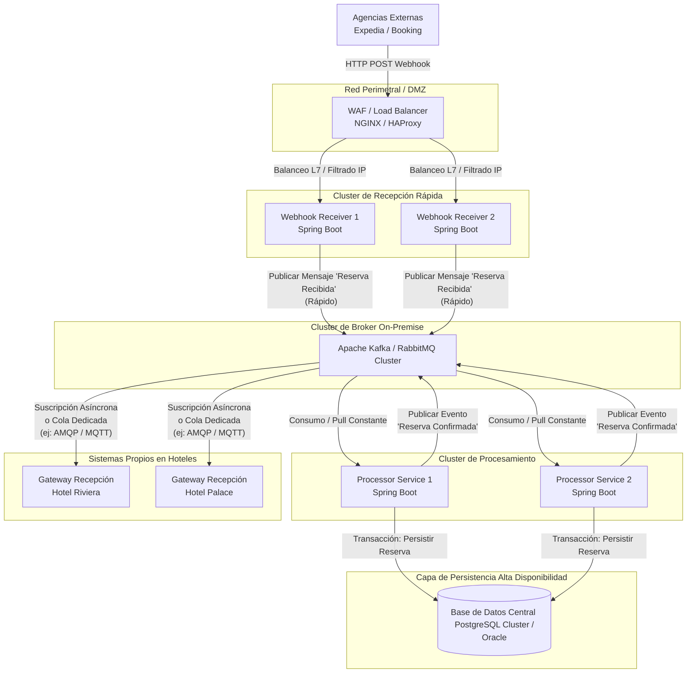

# 🏨 Arquitectura de Recepción de Reservas en Tiempo Real (RIU)

## 📌 Contexto y Reto
Transición de procesos de sincronización batch (cada 2 horas) a un modelo de tiempo real basado en Webhooks impulsado por agencias externas (Expedia, Booking) para eliminar problemas críticos como el overbooking.

**Requisitos Clave:**
- Recibir notificaciones HTTP de forma segura y con alta disponibilidad (miles de peticiones en horas pico).
- Actualizar la Base de Datos Central con la reserva procesada.
- Notificar de forma asíncrona a los sistemas internos de los hoteles (para recepción).
- Infraestructura **100% On-Premise** (sin nube pública).
- Stack tecnológico de backend basado fuertemente en **Java/Spring**.

---

## 🏗️ Diseño de Arquitectura de Alto Nivel

Para cumplir con la alta disponibilidad, absorber picos de tráfico masivos y aislar la latencia del procesamiento pesado, se propone una **Arquitectura Orientada a Eventos (EDA - Event-Driven Architecture)** y basada en Microservicios.

### 📝 Casos de Uso del Flujo de Datos
1. **Recepción (Ingestion):** La agencia externa manda un `POST` al Webhook. El sistema valida rápidamente la petición (seguridad y formato básico), la encola en un Message Broker y responde un `202 Accepted` de inmediato para no hacer esperar al cliente y evitar Timeouts perjudiciales.
2. **Procesamiento (Processing):** Un *pool* de workers consume asíncronamente los mensajes encolados, procesa las reglas de negocio, efectúa la reserva para evitar el overbooking, y la guarda en la Base de Datos Central.
3. **Notificación (Notification):** Una vez persistida en la Base de Datos Central, se emite un evento de notificación que el sistema local del hotel consume de forma asíncrona.

---

## 📊 Diagrama de Arquitectura (Mermaid)

---

## ⚙️ Tecnologías Clave Elegidas (100% On-Premise)

1. **WAF & Load Balancer: NGINX Plus o HAProxy**
   - **Misión Perimetral:** Efectuar terminación TLS, limitar la tasa (rate limiting) para disuadir ataques DDoS o errores de las agencias (Retry Storms), además de un estricto filtrado por IP (Whitelist de las IP oficiales de Booking/Expedia).
   
2. **Webhook API (Recepción): Spring Boot (Spring WebFlux / MVC)**
   - **Misión Ingestion:** Construido con Spring WebFlux (Non-blocking) o Tomcat optimizado para concurrencia extrema. 
   - Su única responsabilidad es validar la integridad (ej. HMAC o Mutual TLS - mTLS) y depositar el payload crudo en el Broker, sin hablar jamás con la Base de datos relacional. 

3. **Message Broker: Apache Kafka (o RabbitMQ)**
   - **Misión Amortiguador:** Columna vertebral del desacoplamiento. Si al mediodía entran 10,000 peticiones en 3 minutos, el Broker absorbe perfectamente la ráfaga.
   - **Elección:** **Kafka** ofrece extrema eficiencia para alto throughput en discos *On-Premise* y permite re-procesamiento. **RabbitMQ** es otra opción excelente y más tradicional (basada en colas AMQP) si se prefieren topologías de ruteo complejas basadas en Topic Exchanges para distribuir a cada Hotel.

4. **Processor Service (Workers): Spring Boot**
   - **Misión Core Business:** Microservicio interno, protegido de internet.
   - Estos nodos extraen mensajes del Broker a la máxima velocidad que permita la Base de Datos Central. Ejecutan la verificación estricta de camas, asignan el cupo (previniendo overbooking gracias al bloqueo en base de datos) y confirman la transacción final.

5. **Base de Datos Central:**
   - Un RDBMS on-premise potente bajo configuración de Alta Disponibilidad Activo-Pasivo o Multi-Master. Tecnologías como **PostgreSQL (usando repmgr o Patroni)** o **Oracle RAC** (si es la política de la empresa) encajan perfectamente al soportar transacciones ACID severas en un entorno local.

6. **Notificación a Recepciones (Hoteles):**
   - Se implementa el Patrón *Outbox* o se publican eventos tras el `commit` de BD de vuelta a un tópico distinto de Kafka/RabbitMQ (`Hotel_Notifications_{ID_HOTEL}`).
   - El sistema local (gateway del Hotel) se conecta hacia el Datacenter Central (usualmente vía VPN/SD-WAN de RIU) manteniendo conexiones ligeras (AMQP, MQTT, o WebSockets) para recibir las notificaciones "Push" e informar a los recepcionistas con latencia de sub-segundos. Si un hotel se queda sin conexión a internet o VPN temporalmente, los mensajes no se pierden, se apilan en su cola dedicada hasta que restablezcan conexión.

---

## 🛡️ Aspectos Críticos Abordados

### 1. Sistema Anti-Colapso y Overbooking
Al usar un patrón de *desacoplamiento mediante Broker* entre la Recepción Web y el Procesamiento transaccional en Base de Datos, se garantiza que **la base central de reservas nunca sufre de contención de recursos por picos externos de tráfico**. La lectura del Broker permite controlar la velocidad de ingesta hacia la BD, previniendo cuellos de botella e interbloqueos, asegurando la consistencia transaccional necesaria para no tener overbooking.

### 2. Alta Disponibilidad (HA) On-Premise
Se requiere la formación de clústeres en todos los servicios:
- > 1 Instancia de Load Balancer
- Clúster N-Nodos de Spring Boot Receivers stateless
- Clúster N-Nodos de Brokers (Kafka/RabbitMQ)
- Alta Disponibilidad en BBDD Central.
Si un servidor físico de RIU en el datacenter de Palma falla, los Load Balancers enrutarán las peticiones de Expedia a un nodo sano sin que haya pérdida de disponibilidad.

### 3. Seguridad de Extremo a Extremo
100% de la carga de configuración y seguridad corre de la mano de RIU al no usar la nube pública:
- Autorización usando tokens (JWT) y validación de Header HMAC firmado por la agencia Expedia/Booking.
- Capa WAF como escudo exterior.
- Uso de redes segmentadas VLAN para las bases de datos y procesadores Spring internos.
- Conexiones encriptadas TLS/SSL en el flujo asíncrono hacia las sedes de los hoteles.
